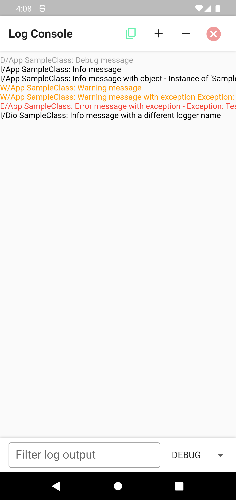
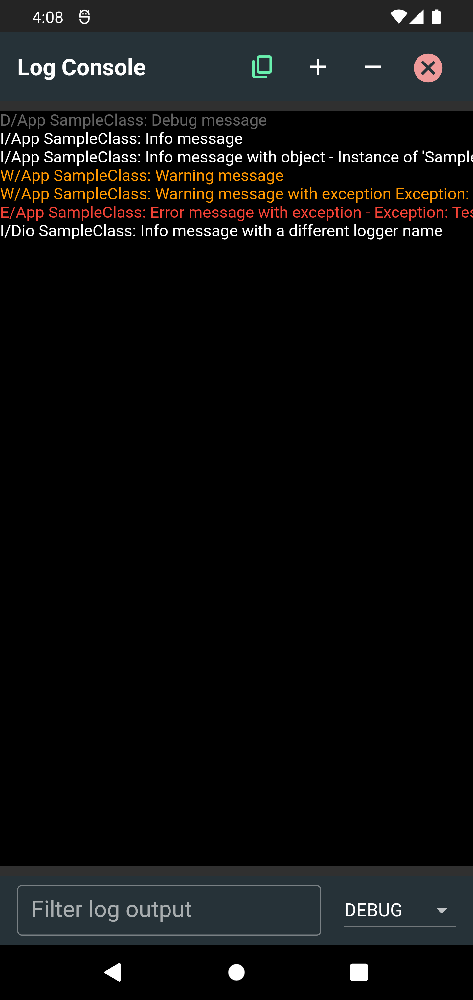

# Logging Flutter

Flutter extension for the [logging](https://pub.dev/packages/logging) package.

## Overview

This package provides a simple tool for logging messages in your applications and a set of additional utilities.

## Features

- Print logs to the console using a standard format.
- Send logs to 3rd party services (ie: Crashlytics, DataDog, etc.)
- Print class and method names where the log was triggered.
- View and share all logs from inside the app.
- Capture and format [logging](https://pub.dev/packages/logging) logs from 3rd party packages.

## Get Started

### Initializing

Use the [Flogger](lib/src/flogger.dart) static class to access all logging methods.

1. Initialize the logger.

    ```dart
    Flogger.init();
    ```

1. Register a listener to print logs to the developer console.

    ```dart
    if (kDebugMode){
        Flogger.registerListener(
            (record) => log(record.message, stackTrace: record.stackTrace),
        );
    }
    ```

### Logging messages

Log messages with their severity using the following methods:

```dart
Flogger.d("Debug message");
Flogger.i("Info message");
Flogger.w("Warning message");
Flogger.e("Error message", stackTrace: null);
```

These calls will result in the logs below when using the default configuration:

```console
[log] D/App SampleClass: Debug message
[log] I/App SampleClass: Info message
[log] W/App SampleClass: Warning message
[log] E/App SampleClass: Error message
```

### Advanced Usage

#### Configuration

Use the [FloggerConfig](lib/src/flogger.dart) class when initializing the Flogger to configure how logs are printed:

```dart
Flogger.init(config: FloggerConfig(...));
FloggerConfig({
    // The name of the default logger
    this.loggerName = "App",
    // Print the class name where the log was triggered
    this.printClassName = true,
    // Print the method name where the log was triggered
    this.printMethodName = false,
    // Print the date and time when the log occurred
    this.showDateTime = false,
    // Print logs with Debug severity
    this.showDebugLogs = true,
    // Print logs with a custom format
    // If set, ignores all other print options
    final FloggerPrinter? printer,
});
```

#### Viewing logs inside the app

Use the [LogConsole](lib/src/log_console.dart) class to view your logs inside the app.

1. Add logs to the console buffer by registering a new listener.

    ```dart
    Flogger.registerListener(
      (record) => LogConsole.add(
          OutputEvent(record.level, [record.printable()]),
          bufferSize: 1000, // Remember the last X logs
      ),
    );
    ```

1. Open the logs console to view all recorded logs.

    ```dart
    LogConsole.open(context)
    ```

<p align="center">
  
&nbsp; &nbsp; &nbsp; &nbsp;
  
</p>

#### Multiple Loggers

Use the `loggerName` parameter when adding logs to print them as a different logger. This can be useful for differentiating calls made from the different layers in your app. For example:

```dart
    Flogger.i("Info message", loggerName: "Network");
    Flogger.w("Warning message", loggerName: "Database");
```

#### Logging to 3rd party services

Register additional listeners to send logs to different services, for example:

```dart
if (kReleaseMode) {
    Flogger.registerListener((record) {
        // Filter logs that may contain sensitive data
        if(record.loggerName != "App") return;
        if(record.message.contains("apiKey")) return;
        if(record.message.contains("password")) return;
        // Log to 3rd party services
        FirebaseCrashlytics.instance.log(record.message);
        DatadogSdk.instance.logs?.info(record.message);
    });
}
```

## Contributing

Contributions are most welcome! Feel free to open a new issue or pull request to make this project better.

## Deployment

1. Set the new version on the [pubspec.yaml](pubspec.yaml) `version` field.
2. Update the [CHANGELOG.md](CHANGELOG.md) file documenting the changes.
3. Update the [README.md](README.md) file if necessary.
4. Run `dart doc` to update the documentation.
5. Run `dart pub publish --dry-run` to ensure the package can be published successfully.
6. Create a new tag with the release version `git tag -a x.y.z -m "x.y.z" && git push --tags`.
7. Navigate to [GitHub Releases](https://github.com/levin-riegner/logging_flutter/releases) and create a new release for the previously created tag, including the [CHANGELOG.md](CHANGELOG.md) changes.
8. Finally run `dart pub publish` to deploy the project.

## Credits

- [Logging](https://github.com/dart-lang/logging) - Copyright (c) 2013 the Dart project authors [BSD 3-Clause](https://github.com/dart-lang/logging/blob/master/LICENSE) for providing the logging framework this library depends on.
- [Logger Flutter](https://github.com/leisim/logger_flutter) - Copyright (c) 2019 Simon Leier [MIT License](https://github.com/leisim/logger_flutter/blob/master/LICENSE) for creating the log console.

## License

This repo is covered under the [MIT License](LICENSE).
