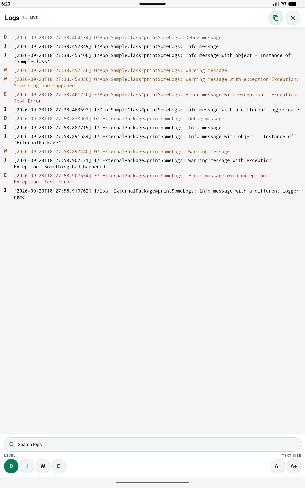
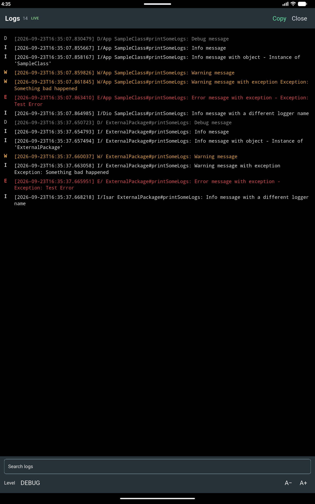

# Logging Flutter

Flutter extension for the [logging](https://pub.dev/packages/logging) package.

## Overview

This package provides a simple tool for logging messages in your applications and a set of additional utilities.

`Flogger.d/i/w/e` send messages through Dart's `logging` package. `Flogger` listeners receive a `FloggerRecord`, which can be printed or forwarded to another service. The in-app `LogConsole` has its own buffer: register a listener that calls `LogConsole.add` to populate it.

Version 4.0 requires Dart 3.12 and Flutter 3.47 or newer, and declares Android and iOS support. See the [migration guide](MIGRATION.md) when upgrading from 3.x.

## Features

- Print logs to the console using a standard format.
- Send logs to 3rd party services (ie: Crashlytics, DataDog, etc.)
- Print class and method names where the log was triggered.
- View and share all logs from inside the app.
- Capture and format [logging](https://pub.dev/packages/logging) logs from 3rd party packages.

## Get Started

### Initializing

Use the [Flogger](lib/src/flogger.dart) static class to access all logging methods.

1. Initialize the logger.

    ```dart
    Flogger.init();
    ```

1. Register a listener to print logs to the developer console.

    ```dart
    if (kDebugMode) {
      Flogger.registerListener(
        (record) => log(record.printable(), stackTrace: record.stackTrace),
      );
    }
    ```

    `registerListener` returns a `FloggerListenerRegistration`. Keep it and call `await registration.cancel()` when a listener belongs to a shorter-lived component. `Flogger.clearListeners()` cancels only listeners registered through `Flogger`.

    `Flogger.init` sets `Logger.root.level` to `Level.ALL` or `Level.INFO` according to `showDebugLogs`, so the setting also affects logs from other packages using `logging`.

### Logging messages

Log messages with their severity using the following methods:

```dart
Flogger.d("Debug message");
Flogger.i("Info message");
Flogger.w("Warning message");
Flogger.e("Error message");
```

`FloggerRecord.message` contains the unformatted message. `record.printable()` applies the configured prefix, timestamp, and custom printer.

These calls will result in the logs below when using the default configuration:

```console
[log] D/App SampleClass: Debug message
[log] I/App SampleClass: Info message
[log] W/App SampleClass: Warning message
[log] E/App SampleClass: Error message
```

### Advanced Usage

#### Configuration

Use [FloggerConfig](lib/src/flogger.dart) to choose the logger name, caller names, timestamps, debug filtering, or a custom printer:

```dart
Flogger.init(
  config: const FloggerConfig(
    loggerName: 'App',
    printClassName: true,
    printMethodName: false,
    showDateTime: false,
    showDebugLogs: true,
  ),
);
```

Set `printer` to a `FloggerPrinter` for a custom display string; it overrides the other print options.

#### Viewing logs inside the app

Use the [LogConsole](lib/src/log_console.dart) class to view your logs inside the app.

1. Add logs to the console buffer by registering a new listener.

    ```dart
    Flogger.registerListener(
      (record) => LogConsole.add(
          OutputEvent(record.level, [record.printable()]),
          bufferSize: 1000, // Remember the last X logs
      ),
    );
    ```

1. Open the logs console to view all recorded logs.

    ```dart
    LogConsole.open(context);
    ```

The console updates while it is open. Search and severity filters apply to the displayed list and to Copy; copied text includes every matching row in its original case. `LogConsole.clear()` removes buffered logs. `bufferSize` must be positive and defaults to 1000.

`LogConsole.open` uses the system light or dark setting by default. Pass `dark: true` or `dark: false` when your app's theme differs from the system setting. The console uses Flutter's core widgets, so it can open from Material, Cupertino, or custom widget apps.

<p align="center">
  
&nbsp; &nbsp; &nbsp; &nbsp;
  
</p>

#### Multiple Loggers

Use the `loggerName` parameter when adding logs to print them as a different logger. This can be useful for differentiating calls made from the different layers in your app. For example:

```dart
    Flogger.i("Info message", loggerName: "Network");
    Flogger.w("Warning message", loggerName: "Database");
```

#### Logging to 3rd party services

Register additional listeners to send logs to different services, for example:

```dart
if (kReleaseMode) {
    Flogger.registerListener((record) {
        // Filter logs that may contain sensitive data
        if(record.loggerName != "App") return;
        if(record.message.contains("apiKey")) return;
        if(record.message.contains("password")) return;
        // Log to 3rd party services
        FirebaseCrashlytics.instance.log(record.printable());
        DatadogSdk.instance.logs?.info(record.printable());
    });
}
```

## Contributing

Contributions are most welcome! Feel free to open a new issue or pull request to make this project better.

## Deployment

1. Set the new version on the [pubspec.yaml](pubspec.yaml) `version` field.
2. Update the [CHANGELOG.md](CHANGELOG.md) file documenting the changes.
3. Update the [README.md](README.md) file if necessary.
4. Run `fvm flutter pub get`, `fvm dart format --output=none --set-exit-if-changed lib test`, `fvm flutter analyze`, and `fvm flutter test`.
5. Analyze and build the example's Android and iOS debug apps, and check an app using a local path dependency.
6. Run `fvm flutter pub publish --dry-run` and review the files and warnings.
7. Publish with `fvm flutter pub publish` after the release PRs are merged.
8. Tag the published commit and create a [GitHub release](https://github.com/levin-riegner/logging_flutter/releases) using the [CHANGELOG.md](CHANGELOG.md) entry.

## Credits

- [Logging](https://github.com/dart-lang/logging) - Copyright (c) 2013 the Dart project authors [BSD 3-Clause](https://github.com/dart-lang/logging/blob/master/LICENSE) for providing the logging framework this library depends on.
- [Logger Flutter](https://github.com/leisim/logger_flutter) - Copyright (c) 2019 Simon Leier [MIT License](https://github.com/leisim/logger_flutter/blob/master/LICENSE) for creating the log console.

## License

This repo is covered under the [MIT License](LICENSE).
